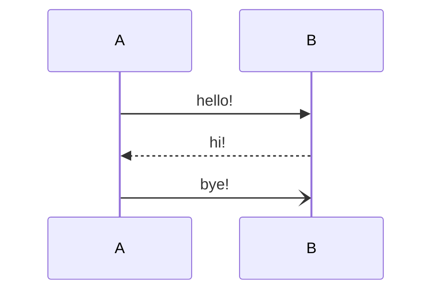

# 一级标题

## 二级标题

### 三级标题

#### 四级标题

##### 五级标题

###### 六级标题

这是正文内容 👍👍👍

**这是加粗内容**

`行内代码`

_这是斜体内容_

~~这是删除线内容~~

<u>这是下划线内容</u>

- 无序列表
  - 无序列表

1. 有序列表
2. 有序列表
3. 有序列表

|   表头   |   表头   |   表头   |
| :------: | :------: | :------: |
| 示例内容 | 示例内容 | 示例内容 |

- [ ] 未完成任务
- [x] 完成任务

[示例链接](https://www.example.com)

# HTML 标签

X<sup>2</sup>

A<sub>1</sub>

<details>
  <summary>摘要</summary>
  <p>详情内容</p>
</details>

<acronym title="全称详情">缩略语</acronym>

# 公式

$$
S_{n}=\frac{n \left( a_{1}+a_{n}\right)}{2}
$$

$$
Q = I ^ { 2 } R \mathrm { t }
$$

# 时序图



# 代码块

## Java

```java
import jakarta.persistence.Column;
import jakarta.persistence.Entity;

@Getter
@Setter
@Builder
@Entity
@Table(name = "announcement")
public class Announcement extends BasePo {
    @Id
    @GeneratedValue(strategy = GenerationType.IDENTITY)
    @Column
    private Integer announcementId;
    @JdbcTypeCode(SqlTypes.JSON)
    @Column(columnDefinition = "json")
    private List<String> paragraphList;
    @Column(columnDefinition = "varchar(100) default 'blue'")
    private String color;
    private String dot;
}
```

## JavaScript

```js
import React from 'react';
import {createRoot} from 'react-dom/client';
import {BrowserRouter, Route, Routes} from "react-router-dom";
import Home from "./page/Home";
import NotFound from "./page/NotFound";
import Editor from "./page/Editor";

const container: Element | null = document.getElementById('root');

if (container != null) {
    const root = createRoot(container);

    root.render(
        <BrowserRouter>
            <Routes>
                <Route path={"/"} element={<Home key={"home"}/>}/>
                <Route path={"/editor"} element={<Editor key={"editor"}/>}/>
                {/*从上到下匹配，上方全未匹配命中则说明该跳转到 404 页面*/}
                <Route path={"*"} element={<NotFound key={"notFound"}/>}/>
            </Routes>
        </BrowserRouter>
    );
}
```

## Json

```json
{
  "key": "value",
  "count": -100,
  "person": [
    {
      "id": 1,
      "name": "张三"
    },
    {
      "id": 2,
      "name": "李四"
    }
  ]
}
```

## Properties

```properties
springdoc.api-docs.enabled=false
springdoc.show-actuator=true
springdoc.swagger-ui.path=/swagger-ui.html
springdoc.swagger-ui.docExpansion=none
springdoc.swagger-ui.defaultModelsExpandDepth=0
```

## Yml

```yml
config-attributes:
  value: 345                         #对应单个值
  valueArray: 1,2,3,4,5,6,7,8,9      #对应数组
  valueList: #对应list
    - 13579
    - 246810
  valueMap: #对应map
    name: Amy
    age: 20
    sex: female
  valueMapList: #对应list<map>
    - name: aaa
      age: 21
    - name: bbb
      age: 31
```

# 资源


